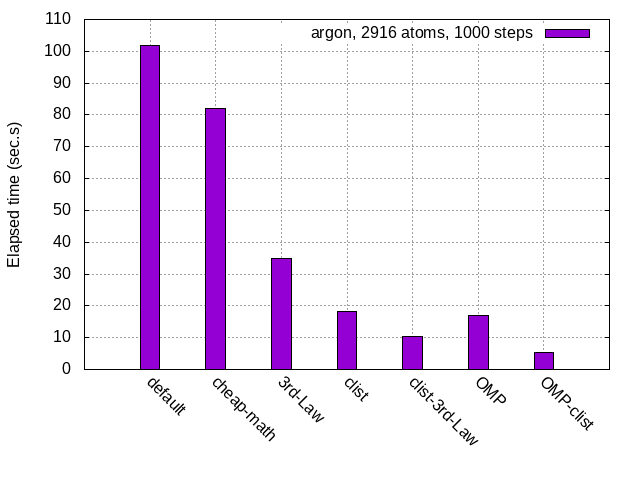
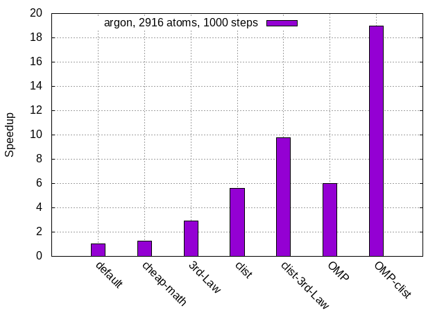

This package contains simplified MD code with multi-threading
parallelization for simulating atoms with a Lennard-Jones potential.

The bundled makefiles are set up to compile the executable once
with OpenMP disabled and once with OpenMP enabled with each build
placing the various object files in separate directories.

The examples directory contains 3 sets of example input decks
and the reference directory the corresponding outputs.

Type: make
to compile everything and: make clean
to remove all compiled objects1

### Performance

Here below we briefly report on how our performances improved with optimizations. The execution times refer to the C code (no python), with 2916 atoms and 1000 steps.

The first graph shows the total elapsed times at various stages, while the second graph shows the corresponding speedup (relative to the time of the default code).

The histogram label legend is as follows:

- default: the original code, split in multiple source files;
- cheap-math (branch `force_1`): force optimization with expensive math avoided and `pbc` function inlined;
- 3rd-law (branch `force_2`): from cheap-math, with 3rd Newton's Law implemented;
- clist (branch `cell_list`): from cheap-math, with clist algorithm implemented;
- clist-3rd-Law (branch `cell_2`): form clist, with 3rd Newton's Law implemented;
- OMP (branch `omp`): from cheap-math, with OMP applied;
- OMP-clist (branch `release_v2`): from clist, with OMP applied.

Please notice that the last version of the code (branch `release_v2`) is still under maintenance. More specifically, we tested that the C code gives correct outputs and we computed the elapsed time. However, we must check the python version and we must also correct conflict-bugs in the automatic tests. Anyway, since it works, we found worth pushing it.

In conclusion, we obtain a final speedup of 19x .

